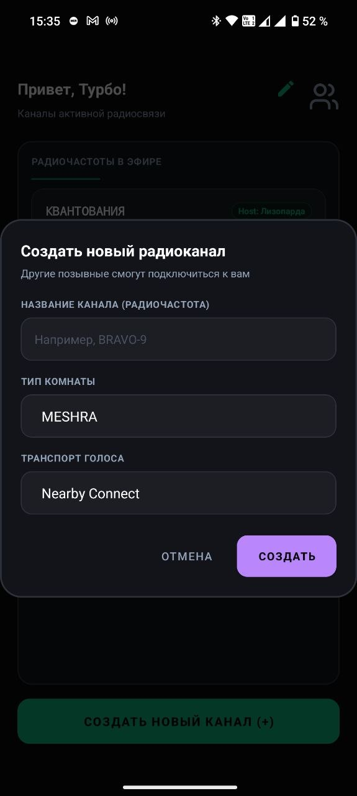
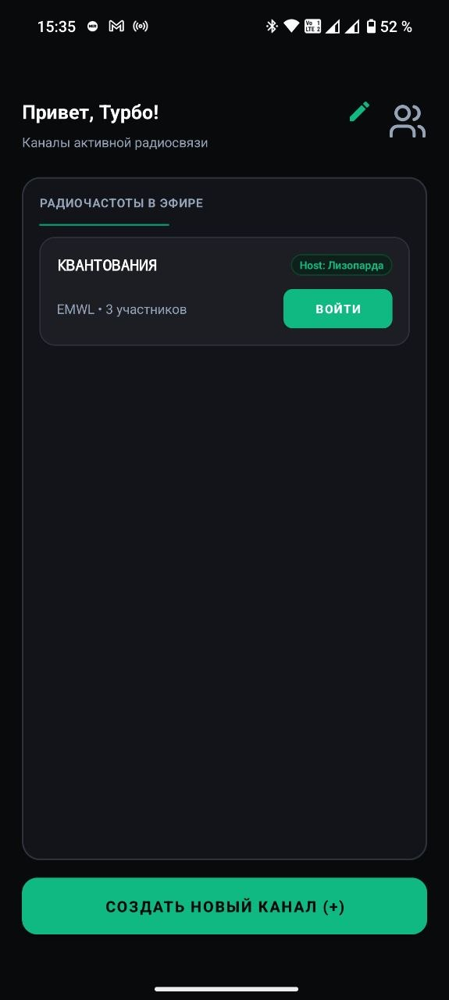
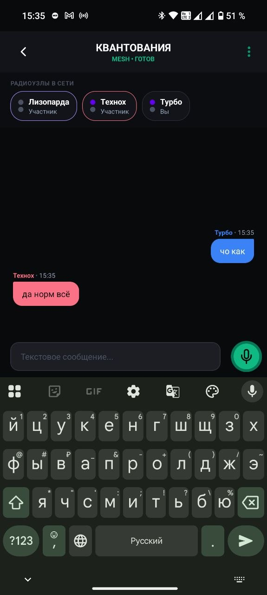

# PSHH MESHRA

PSHH MESHRA — Android-приложение для локальной голосовой связи и сообщений между nearby-устройствами без обязательного внешнего сервера.

Главная идея проекта: комната приложения должна быть логической сетью поверх доступных nearby-транспортов. Wi-Fi Aware, Nearby Connections, Wi-Fi Direct и Bluetooth рассматриваются как способы найти соседей и передать байты, но не как готовая mesh-сеть.

Приложение уже позволяет сравнивать несколько режимов комнаты и голоса: обычную Nearby Star-комнату, MESHRA-комнату поверх Nearby Connections, голос через Nearby BYTES и отдельный голосовой media-plane через Wi-Fi Direct UDP.

## Скриншоты

<p>
  
  
  
</p>


## Текущее состояние

- Комнаты и участники управляются через `RoomRuntime`.
- Нижний соседский транспорт вынесен в `NeighborTransport`; текущая реализация работает поверх Google Nearby Connections.
- Есть два режима комнаты:
  - `Nearby Star` — классическая комната с host-ом и прямыми client-ами;
  - `MESHRA` — экспериментальный app-level mesh-режим, где каждый участник может рекламировать комнату как gateway, а room events и voice frames пересылаются через соседей.
- Голосовой media-plane отделен от room signaling:
  - `Nearby Connect` — голосовые Opus frames идут compact Nearby BYTES пакетами `SV`;
  - `MESHRA voice` — голос идет compact пакетами `MV` внутри mesh flood-а, с отдельным dedup-cache и TTL;
  - `Wi-Fi Direct` — отдельный UDP media-plane поверх Wi-Fi Direct group, где UUID передается в handshake, но не повторяется в каждом аудиофрейме.
- Создатель выбирает длину Opus-фрейма `10/20/40 мс`; профиль входит в meta комнаты, а последний выбор запоминается отдельно для `Nearby Star` и `MESHRA`.
- В MESHRA текстовые сообщения и события участников уже идут через app-level flooding с TTL и дедупликацией.
- В MESHRA voice уже работает как realtime payload, но пока без jitter buffer, route selection и возрастного drop старых аудиофреймов.

## Архитектурная позиция

Mesh-маршрутизацию приложение делает само поверх соседских линков:

```text
RoomRuntime
  -> RoomTransport / MeshTransport / VoiceTransport
  -> NeighborTransport
  -> Nearby Connections / Wi-Fi Direct / Wi-Fi Aware / Bluetooth
```

Физические nearby-технологии дают только соседские каналы. Room identity, peer identity, relay, TTL, дедупликация, выбор gateway и политика voice-передачи остаются частью протокола приложения.

## Режимы связи

### Nearby Star

Обычный режим комнаты: один host рекламирует комнату, гости подключаются к нему напрямую. Текстовые события идут через host/client signaling. Голос может использовать выбранный host-ом voice transport: Nearby BYTES или Wi-Fi Direct UDP.

### MESHRA

Mesh-режим комнаты: участник после входа тоже рекламирует эту же комнату как gateway. Новые устройства могут войти через любого видимого gateway, а дубли одной комнаты группируются по `discoveryGroupId`.

В MESHRA нет жесткой зависимости жизни комнаты от первого host-а: host остается известным формальным узлом, но события комнаты распространяются по mesh-сети. Сейчас поддержаны вход, выход/разрыв, текстовые сообщения и голосовые Opus frames как ephemeral mesh payload.

### Голос

- `CompactVoicePacketCodec` задает общий 9-байтовый header `magic/control/origin/session/sequence`: Star использует magic `SV`, MESHRA — `MV`.
- Nearby voice: `VoiceRuntime` кодирует микрофон в Opus frames выбранной длины, `NearbyVoiceTransport` отправляет их через Nearby BYTES.
- MESHRA voice: `RoomRuntime` публикует те же compact frames в `MeshTransport`, который flood-ит их соседям с TTL `8`.
- Wi-Fi Direct voice: Nearby используется только для signaling, а Opus идет UDP-пакетами; полный `PeerId` передается один раз в `HELLO/ACK`.

## Документация

- [RoomRuntime](docs/room-runtime.md) — текущая модель комнаты, host/client MVP, voice flow, packetId/TTL и ограничения.
- [Mesh transport](docs/mesh-transport.md) — текущий MESHRA-протокол: gateway advertising, snapshot, events, voice frames, healing links.
- [Mesh network README](docs/mesh-network-readme.md) — фиксация позиции по Wi-Fi Aware, Nearby, Wi-Fi Direct и собственной mesh-маршрутизации.
- [AppContainer](docs/app-container.md) — composition root приложения и выбор реализаций.
- [Repository layer](docs/repository-layer.md) — слой репозиториев.
- [ViewModel layer](docs/viewmodel-layer.md) — слой ViewModel.
- [Roadmap](roadmap.md) — ближайшие продуктовые и сетевые направления.

```text
Под блокировками без общения грустишь?
Попробуй PSHH
```
```
По лесу в поисках шабуршишь?
Используй PSHH
(Товарищ майор, я имел ввиду поиск грибов или пропавших людей, а не того что у вас в пакетике при себе было)
```
